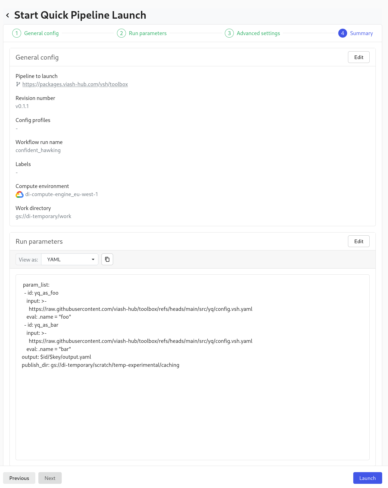
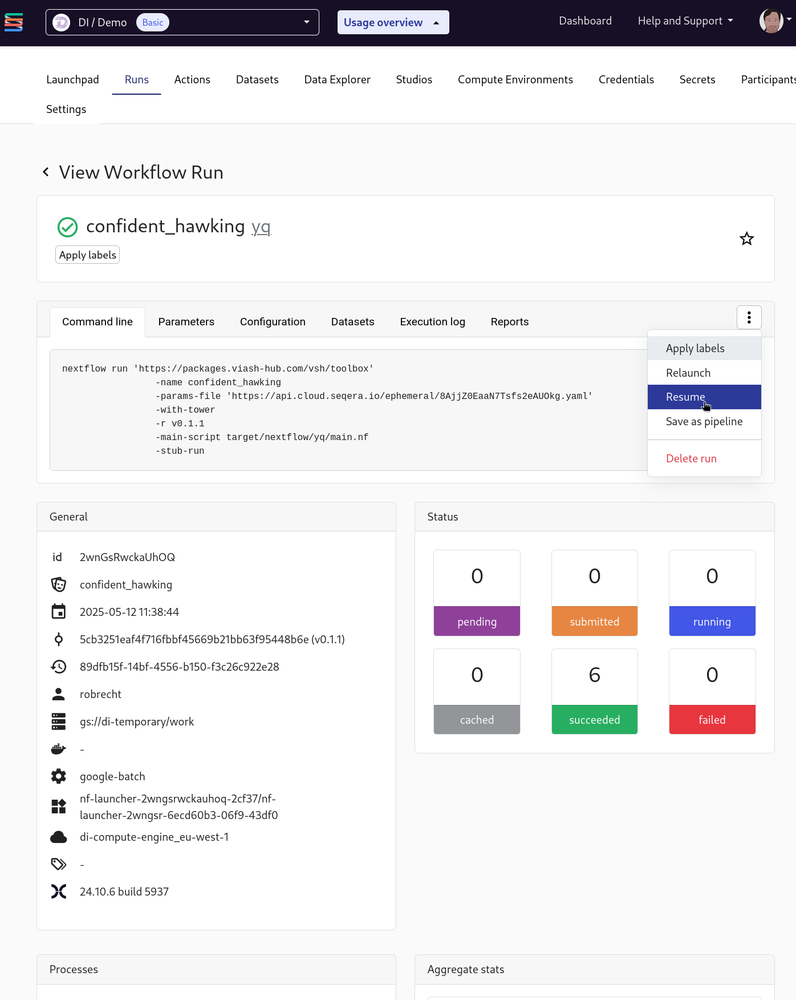
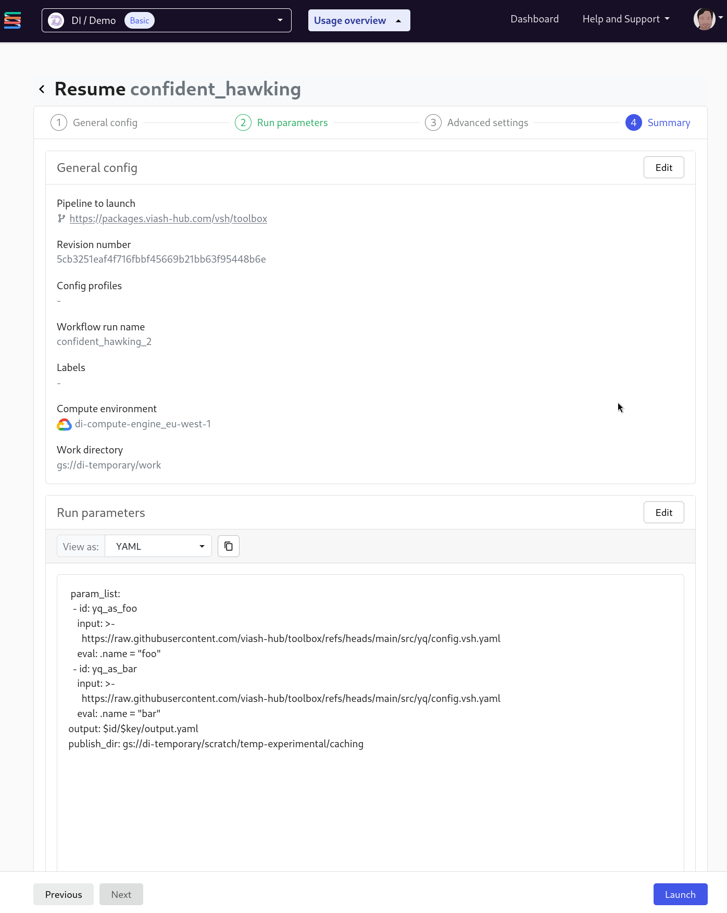
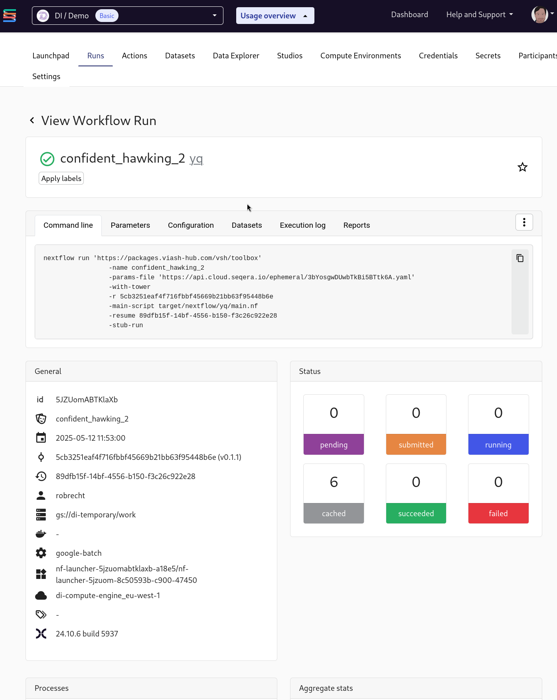

# Experiment with Nextflow caching

## `nextflow run`

Create params file:

```bash
cat > params.yaml <<'EOM'
param_list:
  - id: yq_as_foo
    input: https://raw.githubusercontent.com/viash-hub/toolbox/refs/heads/main/src/yq/config.vsh.yaml
    eval: ".name = \"foo\""
  - id: yq_as_bar
    input: https://raw.githubusercontent.com/viash-hub/toolbox/refs/heads/main/src/yq/config.vsh.yaml
    eval: ".name = \"bar\""
output: "$id/$key/output.yaml"
publish_dir: "gs://di-temporary/scratch/temp-experimental/caching"
EOM
```

Create script:

```bash
cat > script.sh <<'EOM'
curl -s https://api.viash-hub.com/auto-net-config/scm-config | NXF_SCM_FILE=/dev/stdin \
  nextflow run https://packages.viash-hub.com/vsh/toolbox.git \
  -revision v0.1.1 \
  -main-script target/nextflow/yq/main.nf \
  -params-file params.yaml \
  -profile docker \
  -latest \
  -resume
EOM
chmod +x script.sh
```

Run the workflow:

```bash
./script.sh
```

    Nextflow 25.04.0 is available - Please consider updating your version to it

    N E X T F L O W   ~  version 24.10.4

    Pulling vsh/toolbox ...
    WARN: It appears you have never run this project before -- Option `-resume` is ignored
    Launching `https://packages.viash-hub.com/vsh/toolbox` [nauseous_jones] DSL2 - revision: 5cb3251eaf [v0.1.1]

    executor >  local (6)
    [7f/3c2467] process > yq:processWf:yq_process (yq_as_foo)                    [100%] 2 of 2 ✔
    [b5/bfa13a] process > yq:publishFilesSimpleWf:publishFilesProc (yq_as_bar)   [100%] 2 of 2 ✔
    [24/46913c] process > yq:publishStatesSimpleWf:publishStatesProc (yq_as_foo) [100%] 2 of 2 ✔

Run it again:

```bash
./script.sh
```

    Nextflow 25.04.0 is available - Please consider updating your version to it

    N E X T F L O W   ~  version 24.10.4

    Pulling vsh/toolbox ...
    Launching `https://packages.viash-hub.com/vsh/toolbox` [insane_boyd] DSL2 - revision: 5cb3251eaf [v0.1.1]

    [7f/3c2467] process > yq:processWf:yq_process (yq_as_foo)                    [100%] 2 of 2, cached: 2 ✔
    [05/c5a1c4] process > yq:publishFilesSimpleWf:publishFilesProc (yq_as_foo)   [100%] 2 of 2, cached: 2 ✔
    [24/46913c] process > yq:publishStatesSimpleWf:publishStatesProc (yq_as_foo) [100%] 2 of 2, cached: 2 ✔

## Via Seqera Cloud

Trigger run:



Output:



Trigger resume:



Trigger resume:


